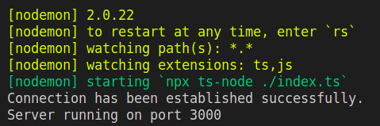
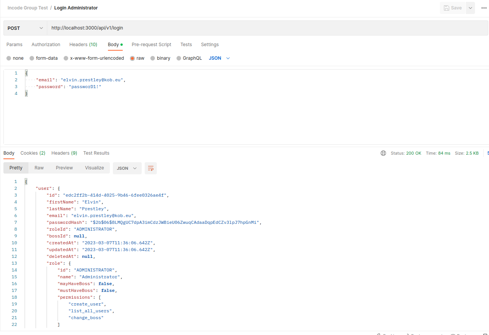
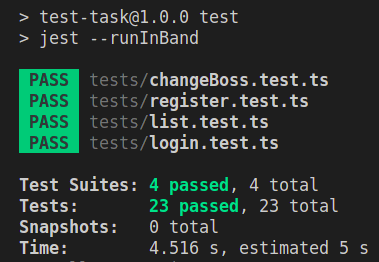

# How to run the application

1. `nvm use 16` (Requirements: Node.JS v.16)
2. `npm ci` to install packages
3. Ensure that another postgres is not running and execute `docker-compose up -d`
4. Copy everything from `.env.example` file to `.env` file (create it)
5. `npm run migrate` to run migrations
6. `npm run seed` to run seeds
7. `npm run dev` to run the application
8. You can also import Postman collection from file `Incode Group Test.postman_collection.json`
Success looks like this:

# How to run tests

0. `nvm use 16` (Requirements: Node.JS v.16)
1. Get into postgres docker container `docker exec -it custom_postgres_container psql -U postgres`
2. Create new database (name should be the same as in `.env` file), run `CREATE DATABASE user_organization_test;`
3. Exit container `\q`
4. npm run migrate-test
5. npm test

Success looks like this:

## Task details

1. In the task it was mentioned that there must be 3 roles: Administrator, Boss and Employee.
   When I was doing the task, I discovered that Boss role is useless and I could use only 2 roles.
   But I thought, maybe that third role will be important in future app development, so I didn't remove it.
2. `Register user`
   It wasn't mentioned anywhere, but I thought it would be logical to give permission to add new users only for Administrator.
   When you register a new user, you can provide a boss for him. If provided boss has role `EMPLOYEE` it will be changed to `BOSS` as for npw he has a subordinate.
3. `Authenticate as user`
   I decided to use JWT auth using Access/Refresh tokens. When user send a request to `/login` he gets Access and Refresh tokens to his cookies (cookies are httpOnly) (they also should be secure for HTTPS).
   Access token lives for 15min. After that client should use refresh token to get new access token. Refresh token lives for 15days. So basically the user will need to authenticate once per 15 days.
   Password is stored at the database as hash created by bcrypt
4. `List of users`
   Administrator sees everyone
   Boss sees himself and him subordinates recursively
   Employee sees only himself.
5. `Change user's boss`
   It wasn't mentioned, but I think its logical that administrator can change boss for everybody.
   Employee can not change it at all.
   Target boss may not have role `ADMINISTRATOR`\
   It was mentioned: "`Change user's boss (only boss can do that and only for her subordinates)`". That's why here is no recursion.
   If new boss has role `EMPLOYEE` it will be changed to `BOSS` as for npw he has a subordinate.
   If old boss does not has subordinates anymore his role will be changed to `EMPLOYEE`.

## Database

I used PostgreSQL as I have way more experience in it. There are 2 tables: `Users` and `Roles`. `Roles` table is a table for configurable information about each role. To change permissions in future We should create some script to run and update them.

### Relations in database

- `Users` N : 1 `Roles` - alias `role`
- `Users` 1 : N `Users` - alias subordinates

## Architecture

I used layer architecture that means the app is divided into layers that are independent. Layers:

1. Router - there will be many routers for different entities. This layer connects endpoind and controller to run
2. Middleware - there are 2 middlewares right now: auth and error handling. They provide some basic and common actions that should be executed before or after main logic.
3. Controller - this layer does some basic tasks like: validation, checking permissions, calling service functions and sending response. Controller does not know anything about database and models.
4. Service - this layer provides some business logic, it uses model inside of it to get and update data in database.
5. Model - this layer provides logic connection between entity in code and database table. It represents attributes of the table and it's relations.
6. ORM and database - operated and stores data

## Clean code

I used Eslint config from Metarhia and prettier.
Usually I also create some CI/CD to check whether code is formatted and Husky git hooks.
